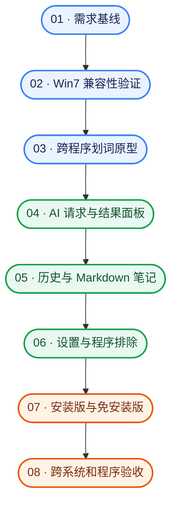

# AI 划词工具栏

面向 Windows 的 AI 划词助手。用户选中文字后，可在选区附近打开悬浮工具栏，执行解释、翻译或自由提问，并把解释整理为本地 Markdown 学习笔记。

> 项目状态：已提交 Windows 代码原型，已在 Windows CI 编译通过，尚未通过 Windows 7/11 实机验收；已配置生成安装包和免安装版的 CI 流程，仍需核验本分支构建产物。本文中的界面是交互草图，不代表最终视觉稿。

## 核心功能

| 功能 | 首版行为 |
| --- | --- |
| 划词唤出 | 鼠标选中文字并松开后，在选区附近显示工具栏；键盘选中后使用快捷键唤出 |
| AI 解释 | 对选中文本生成解释，在就近面板中流式显示，支持停止生成 |
| AI 翻译 | 默认翻译为简体中文，可在设置中更改目标语言 |
| 自由提问 | 以选中文本为上下文输入问题，并显示流式回答 |
| 做笔记 | 解释完成后由用户点击保存；保存前可编辑，本地 Markdown 按来源与日期归档 |
| 历史追溯 | 本地数据库保存原文、动作、问题、回复、来源与时间；可搜索、单条删除或清空 |
| 程序排除 | 可排除指定程序；排除后不读取选中文本、不弹工具栏、不记录历史 |
| API 配置 | 配置 API 地址、密钥和模型名称；兼容 OpenAI API 格式，可填写本机服务地址 |

只有点击 AI 动作时才向配置的接口发送选中文本。未配置 API 时，引导用户进入设置，不发出请求。

### 支持范围

- 操作系统目标：Windows 7 SP1 **64 位**至 Windows 11。
- 首版验收程序：Chrome、Edge、Firefox、Microsoft Word、PowerPoint、Adobe Acrobat Reader。
- PDF：处理阅读器中可选中的文字；首版不做扫描件 OCR。
- 发布形式：安装包与免安装压缩包。开机启动、检查更新均为可选且默认关闭；更新只提示，不自动安装。

Windows 7 上的浏览器验收需要使用该系统可运行的对应版本。目标程序中的选区获取、定位和来源识别仍需原型验证；详见[完整需求方案](./AI划词工具栏_需求方案_v0.1.md)。

## 界面与操作流程

以下为功能布局草图，尺寸、图标和配色待设计。

### 1. 悬浮工具栏与结果面板

```text
用户选中的文字
        └─ 鼠标松开 / 按快捷键
             ┌───────────────────────────────┐
             │ 解释  │ 翻译  │ 提问  │ 关闭      │
             └───────────────────────────────┘
                         │ 点击 AI 动作
             ┌───────────────────────────────┐
             │ 选中的原文与来源               │
             │ AI 结果（可滚动、流式显示）     │
             │ 停止生成  │ 做笔记（解释结果）  │
             └───────────────────────────────┘
```

“做笔记”仅在解释结果的保存流程中使用。关闭面板后，可从历史记录重新查看已保存的结果。

### 2. 做笔记

```text
解释结果 → 点击“做笔记” → 编辑原文/解释 → 确认保存
                                          ↓
                         本地 日期_来源文件名_学习.md
```

同一来源每天使用一个 Markdown 文件，后续笔记追加到该文件。每条笔记包含时间、来源、原文和解释；重复保存同一条时提示。来源优先取网页标题或网址、Office/PDF 文件名，取不到时退回到程序名或“未命名”。笔记默认保存在“文档/AiSelectionToolbar/Notes”，可在设置中改为绝对路径。

### 3. 设置与历史

| 页面 | 主要内容 |
| --- | --- |
| 设置 | API 地址、密钥、模型名、翻译目标语言、排除程序、笔记目录、开机启动；检查更新待实现 |
| 历史 | 搜索与查看记录、单条删除、清空全部记录 |

## 开发流程



| 阶段 | 需要验证的结果 |
| --- | --- |
| 兼容性原型 | 程序可在 Windows 7 SP1 64 位运行，能创建基础悬浮窗 |
| 划词原型 | 在六类目标程序中验证选中文本、选区位置和来源信息的获取 |
| 核心功能 | 解释、翻译、提问可连接兼容 API 与本地 API，支持流式结果和停止 |
| 本地数据 | 历史可追溯；Markdown 笔记可编辑、追加并提示重复保存 |
| 发布验收 | 安装版和免安装版完成 Windows 7 与 Windows 11 的核心场景测试，并记录目标程序版本 |

原型选用 .NET Framework 4.8 WPF、Ctrl+Shift+Space 快捷键、用户本地数据目录和 DPAPI 密钥保护；这些实现仍需按目标系统与程序完成验证。构建方法与未完成事项见[开发说明](./docs/DEVELOPMENT.md)。

## 文档

- [已确认需求与首版验收场景](./AI划词工具栏_需求方案_v0.1.md)
